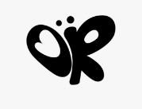
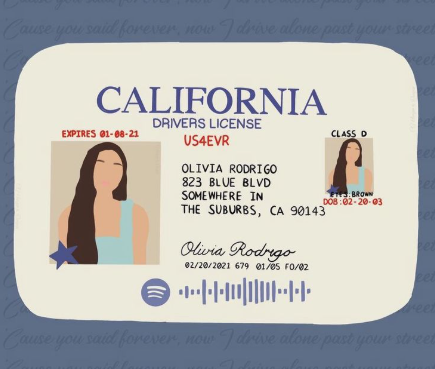

# PRIMEIRAPAGINANINA
<!DOCTYPE html>
<html lang="pt-br">
<head>
    <meta charset="UTF-8">
    <meta name="viewport" content="width=device-width, initial-scale=1.0">
    <title>Olivia Rodrigo</title>

    
</head>

<body>

    <header>
        <h1>OLIVIA RODRIGO</h1>
        
Bem-vindo ao universo da artista

    </header>

    <main>
        

        <h2>Olivia Rodrigo</h2>
        
Por: Nina Lara

        

            Bem-vindo ao site sobre a Olivia Rodrigo!  

            Aqui é o lugar certo pra quem curte as músicas dela, quer saber mais sobre a carreira e descobrir um pouco do universo da Olivia. Ela ficou famosa com “drivers license” e, desde então, vem lançando músicas que falam de sentimentos reais, tipo amor, términos e aquelas fases meio confusas da vida que todo mundo já viveu.  

            Fica à vontade pra explorar o site e mergulhar nesse mundo dela — tem muita coisa legal pra conhecer!
        

        <button>❤️ 0</button>

    </main>

    <main>
        

        <h2>Olivia Rodrigo</h2>
        
Por: Nina Lara

        

          
           A música "drivers license", de Olivia Rodrigo,a sua musica mais famosas, foi lançada em 2021 e fala sobre a tristeza após o fim de um relacionamento. A carteira de motorista representa um sonho que perdeu o sentido com a separação. A canção fez grande sucesso mundial e ganhou um Grammy.  
           

        <button>❤️ 0</button>

    </main>

    

</body>
</html>
